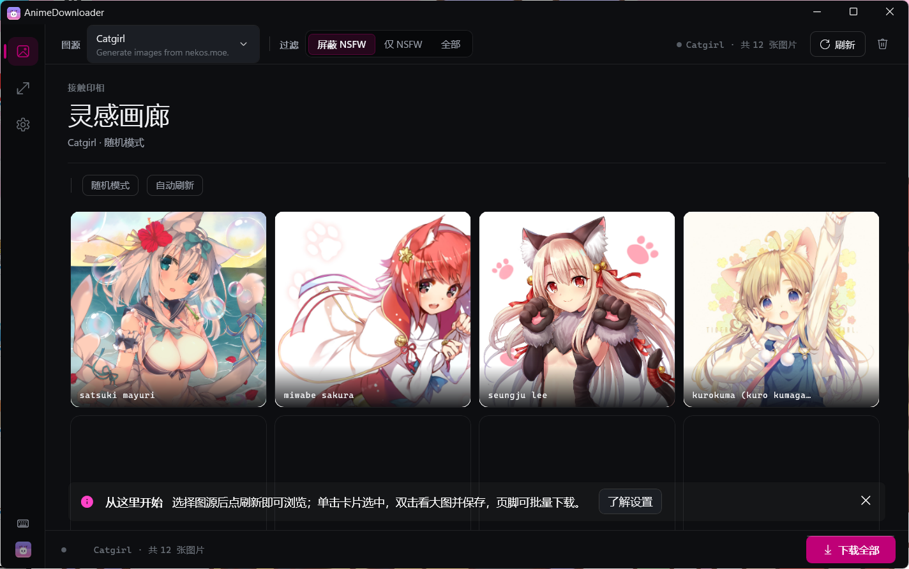
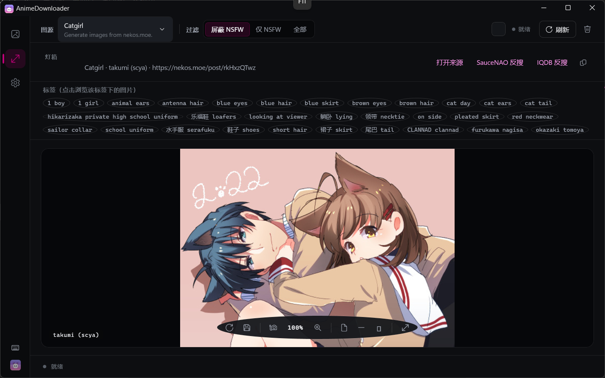
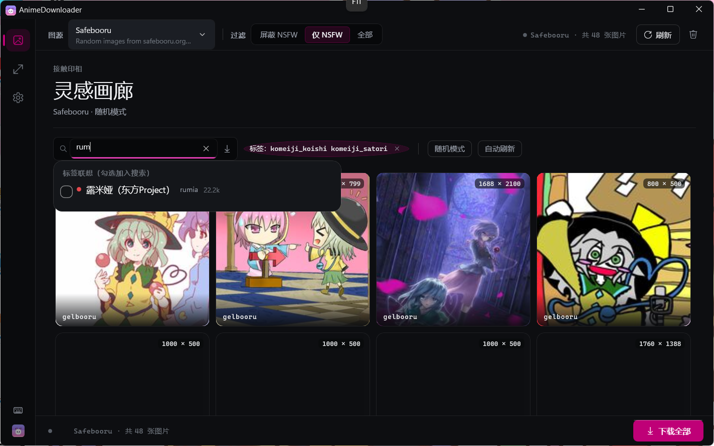
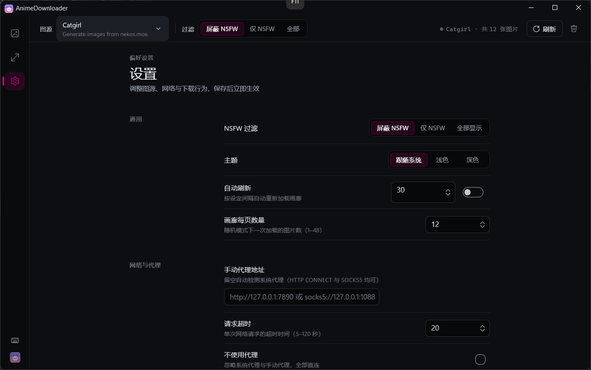

# AnimeDownloader

> 基于 **WinUI 3 + C# (.NET 10)** 的动漫图片浏览与下载桌面应用。
> 功能参考 [CatgirlDownloader](https://github.com/NyarchLinux/CatgirlDownloader)（GTK4/Python），
> 界面与实现均为全新设计。




---

## 目录

- [亮点](#亮点)
- [界面](#界面)
- [功能](#功能)
- [键盘快捷键](#键盘快捷键)
- [图源一览](#图源一览)
- [构建与运行](#构建与运行)
- [打包安装包](#打包安装包)
- [项目结构](#项目结构)
- [配置与数据目录](#配置与数据目录)
- [测试](#测试)
- [常见问题](#常见问题)
- [相关文档](#相关文档)
- [许可](#许可)

---

## 亮点

| | |
| --- | --- |
| **9 个图源开箱可用** | 随机 / 分页两种浏览模式，可标签搜索、可按 NSFW 分级过滤；新增图源只需实现一个适配器 |
| **配色等于你的 Windows** | 强调色取自系统 Accent Color，运行中改 Windows 强调色或深浅色，应用即时跟随 |
| **标签看得懂** | 查看器展示全部标签（中文译名 + 类别圆点）；输入框按热度联想、勾选即加入搜索；内嵌 5000 条热门标签中英对照表，离线也能联想 |
| **网络真的能连上** | 自研 SOCKS5 / HTTP CONNECT 隧道；系统代理探测 → 协议不符回退 → 传输故障再回退直连的三级链路 |
| **省流量、秒回看** | 非查看器界面只加载缩略图，无原生缩略图的源本地小尺寸解码；内存 LRU + 磁盘两级缓存，重复浏览零网络请求 |
| **原生观感** | Win11 Mica 材质、亮 / 暗 / 跟随系统三态主题、未打包部署（目标机免装 Windows App SDK） |

---

## 界面

### 设计语言：暗房（Darkroom）

界面改版遵循一套明确的设计语言。一句话概念：**这个应用是一间暗房** —— 中性冷调的炭灰是「房间」，
图片是唯一的光源，**用户的 Windows 强调色是暗房里的安全灯**。

这个比喻不是修辞装饰，它直接决定了三条硬规则：

1. **全应用只有一个彩色：系统强调色。** 且只在三种语义上亮起 —— *正在被选中 / 正在进行 / 需要你注意*。
   就绪是灰的（无光源），加载中是强调色（灯亮着），故障是红的。
2. **层级不用阴影，只用表面色阶 + 1px 极细线。** 暗房里没有投影，只有离灯远近不同的灰。
3. **所有数字都用等宽字体** —— 页码、分辨率、缩放百分比、版本、快捷键、路径。
   这一条几乎不花成本，却立刻把界面从「网页」拉到「仪器」。

### 强调色跟随 Windows，而不是硬编码品牌色

这里刻意没有定义品牌色。做法是把 `AppAccent*` 令牌接到 Fluent 的 `SystemAccentColor*` 基线，
再由 `WindowsColorScheme` 服务在运行时读取 `UISettings` 并回写：

| 令牌 | 暗色 | 亮色 | 用途 |
| --- | --- | --- | --- |
| `AppAccentBrush` | `SystemAccentColor` | `SystemAccentColorDark1` | 主操作填充、活动指示、忙碌状态 |
| `AppAccentStrongBrush` | `SystemAccentColorLight1` | `SystemAccentColorDark2` | 悬停 / 按压 |
| `AppAccentSoftBrush` | 强调色 @16% | 强调色 @12% | 选中底衬（导轨项、分段器、标签 chip） |
| `AppAccentLineBrush` | 强调色 @42% | 强调色 @45% | 选中描边、卡片悬停内描边 |
| `AppAccentInkBrush` | 自动取黑或白 | 自动取黑或白 | 压强调色块上的文字 |
| `AppFocusRingBrush` | = 强调色 | = `Dark1` | 焦点环（2px） |

几个刻意的细节：

- **暗色用原值、亮色降一档。** `SystemAccentColor` 是 Windows 为深色底挑的值，直接放到浅底上当描边会偏亮、对比不足；
  亮色模式整体下沉（`Dark1` / `Dark2`），这也是 WinUI 自身 `AccentFillColor*` 的处理方式。
- **底衬始终用系统原色**（亮色下也是）。浅底上 12% 的淡衬需要「发光」，跟着压深会糊成一团灰。
- **墨色按 WCAG 相对亮度自动判定**（阈值 `0.4`）：高于阈值给深墨 `#141518`，低于给白。
  于是无论用户选的是明黄、薄荷还是深靛，实心按钮上的文字都可读 —— 不需要为每个色相手工配一个墨色常数。
  判定用的是**该主题实际生效的强调色**，所以同一个明黄 `#FFB900` 在暗色下转深墨、在亮色下因为先下沉到 `Dark1` 又回到白墨。
- **Fluent 自带的强调色一族刻意不覆盖。** `AccentFillColor*` / `TextOnAccentFillColor*` / `FocusStrokeColor*`
  本来就派生自 `SystemAccentColor*` —— 与 `AppAccent*` 同源，因此 `ToggleSwitch` 滑块、`CheckBox` 对勾、
  `ProgressRing`、`ComboBox` 选中项、`TextBox` 焦点下划线**天然一致**，不会出现「应用是紫的、原生控件是蓝的」这种割裂。

身份感改由**表面色阶 + 等宽数字 + 排版**承担，不依赖某一个具体色相。

> 完整设计规范见 [`design/DESIGN.md`](design/DESIGN.md)；
> [`design/preview.html`](design/preview.html) 是可交互样张（浏览器打开，可真实悬停 / 切换亮暗 / 点选 Windows 强调色色板）。

### 截图

**灵感画廊（接触印相）** —— 即页首那张。网格随窗口宽度自适应（2–8 列），
卡片带错峰入场动画、分辨率徽章与艺术家信息条，栏距恒定、卡片在瓦片内居中。

**灯箱（Light Table）** —— 亮色模式下台面依然是深的，图片是唯一的光源；标签栏在图片上方，悬浮工具栏居中。



**标签联想** —— 弹层与搜索框下沿贴合、左边缘对齐；按热度排序，显示中文译名 / 原名 / 帖子数，勾选即加入搜索。



**设置（参数表）** —— Win11 设置风格卡片行（标题 + 描述 + 右侧控件），整页居中收口。



---

## 功能

### 图源与浏览

- **9 个图源**（见[图源一览](#图源一览)），统一实现 `IImageSource`，UI 只依赖接口。
- **随机 / 分页两种模式**；不支持分页的源（如 dmoe）自动隐藏分页控件并给出提示。
- **画廊网格**：随窗口宽度自适应 2–8 列，卡片错峰入场动画、悬浮放大高亮、分辨率徽章、
  艺术家信息条、悬浮快捷保存；栏距 10px 恒定，卡片在瓦片内居中。
- **标签快速搜索**：支持标签的图源显示内联搜索框，回车应用并自动保存，活动标签以可清除胶囊展示。
- **分段式 NSFW 三态过滤**：屏蔽 NSFW / 仅 NSFW / 全部。
- **自动刷新**：可配置间隔。
- **首启引导**：首次运行在画廊底部显示一条可关闭的起步提示，并提供直达设置的入口。

### 标签体系

- **查看器全标签展示**：图片的全部标签（含类别：角色 / 画师 / 作品 / 内容…）以圆点标注，
  热门标签带**中文译名**；点击标签直达该标签的画廊视图。
- **复选框智能联想**：按热度联想，显示中文译名 / 原名 / 帖子数 / 类别，勾选即加入搜索，并给出**相关标签推荐**。
- **内嵌 5000 条热门标签中英对照表**，本地联想兜底，无网络也能用。

### 查看器

- 适应屏幕 / 实际大小 / 拉伸填充 / 缩放（25%–400%，Ctrl+滚轮或 `+` / `-`）。
- 空格换图、Enter 打开大图、`Ctrl+S` 保存、`F11` 全屏、`Esc` 退出全屏。
- **一键复制图片直链**；**SauceNAO / IQDB 以图搜图**一键跳转；来源链接直达原帖。
- 下一张预加载，左下角作者与分辨率信息胶囊。
- 独立大图窗口（`GalleryViewerWindow`）：深色沉浸背景 + 底部浮动工具栏，同样支持键盘导航与全屏。

### 下载

- **批量下载整个画廊**到指定文件夹：按 CPU 核数并行铺开（底层并发闸门统一限流），
  带进度与取消，自动跳过已存在文件，逐文件流式写盘 + 原子改名 —— 落盘始终是原图。
- 并发下载限流、瞬时故障自动重试（指数退避）、可配置请求超时、200MB 单文件上限。

### 网络与代理

- **系统代理自动检测**：环境变量 + Windows 注册表 Internet Settings。
- **自研代理隧道**：.NET 不原生支持 `socks5://`，本项目自研实现，统一支持
  **HTTP(S) CONNECT 与 SOCKS5**、代理认证（`user:password@`）与 `no_proxy` 旁路。
- **三级回退链**：自动检测到的系统代理先探测 SOCKS5 → 协议不符回退 HTTP CONNECT →
  节点传输故障 / 假死超时再回退直连。**手动指定的代理则严格遵从**，不擅自绕过。
- **Gelbooru API 凭据**：Gelbooru 自 2022-09 起停用匿名 API，在设置页填写 `user_id + api_key` 即可正常搜索。
- 设置页内置**检测源连通性**：逐个探测 9 个图源的直连与代理可达性，标出哪些源需要科学上网。

### 性能

- 非查看器界面**只加载缩略图**：有原生缩略图的源直接用小图；无缩略图的源（nekos.moe / dmoe.cc / waifu.im）
  由 `ThumbnailResolver` 回退到原图字节，首次取回后按小尺寸解码并写入**内存 LRU + 磁盘两级缓存**，
  之后重复浏览零网络请求；设置中可配置 `{url}` 压缩代理模板进一步降低首载流量。
- 卡片位图按实际显示尺寸有界解码（`DecodePixelWidth`），`GridView` 虚拟化。

### 界面与个性化

- 主题三态：**跟随系统 / 浅色 / 深色**；Win11 Mica 材质；窗口最小尺寸 980×620（逻辑像素）。
- **全屏（F11）是三层一起收**：窗口呈现器、外壳（导轨列宽归零 + 命令条）、页内控件同时进入沉浸态；
  `Esc` 退出时会还原进全屏前的窗口几何与最大化状态。
- 设置持久化为 JSON，保存后立即生效。

---

## 键盘快捷键

| 快捷键 | 作用 |
| --- | --- |
| `←` / `→` | 上一页 / 下一页 |
| `Space` | 换一张 |
| `Enter` | 打开大图 |
| `Ctrl` + `S` | 保存当前图片 |
| `Ctrl` + `0` | 适应屏幕 |
| `+` / `-` 或 `Ctrl` + 滚轮 | 放大 / 缩小（25%–400%） |
| `F11` | 全屏（进入 / 退出） |
| `Esc` | 退出全屏 |

导轨底部有一枚**快捷键速查**按钮，运行时随时可查。

---

## 图源一览

| ID | 显示名 | 端点 | 分页 | 标签 |
| --- | --- | --- | --- | --- |
| `nekosmoe` | Catgirl | `https://nekos.moe/api/v1/random/image` | 否 | 否 |
| `waifuim` | Waifu | `https://api.waifu.im/images` | 是 | 否 |
| `danbooru` | Danbooru | `https://danbooru.donmai.us/posts.json` | 是 | 是 |
| `lolicon` | Lolicon | `https://api.lolicon.app/setu/v2` | 否 | 是 |
| `dmoe` | Sakura Random | `https://www.dmoe.cc/random.php` | 否 | 否 |
| `safebooru` | Safebooru | `https://safebooru.org/index.php` | 是 | 是 |
| `gelbooru` | Gelbooru | `https://gelbooru.com/index.php` | 是 | 是 |
| `konachan` | Konachan | `https://konachan.com/post.json` | 是 | 是 |
| `yandere` | Yande.re | `https://yande.re/post.json` | 是 | 是 |

- **Lolicon / Sakura Random** 国内可直连。
- **Gelbooru** 需要在设置页填写 API 凭据。
- **Danbooru** 会自动过滤受限标签，设置页实时提示。
- 国内访问 **Danbooru / Gelbooru / Konachan / Yande.re** 通常需要代理，可用设置页的「检测源连通性」确认。

---

## 构建与运行

**要求**：Windows 10 1809+、.NET 10 SDK（10.0.302 或更新）。

应用为**未打包桌面应用**（`WindowsPackageType=None`），`dotnet build` 后即可直接运行，
目标机器**无需安装 Windows App SDK**（自包含运行时已随输出目录分发）。

```bash
dotnet restore
dotnet build AnimeDownloader.slnx -c Debug
dotnet test  AnimeDownloader.slnx -c Debug
```

运行（GUI 应用）：

```bash
dotnet run --project src/AnimeDownloader.App -c Debug
# 或直接运行输出目录中的 exe：
# src/AnimeDownloader.App/bin/x64/Debug/net10.0-windows10.0.19041.0/win-x64/AnimeDownloader.App.exe
```

> 构建开启了 `TreatWarningsAsErrors`，因此任何警告都会中断构建 —— 这是刻意的。

---

## 打包安装包

安装包为简体中文界面，面向普通用户：向导包含许可协议、自定义安装目录（可浏览更改）、
安装完成后提示卸载方式（设置 → 应用 → 已安装的应用，或控制面板 → 程序和功能）。

```powershell
# 不搭载 .NET Runtime 的版本（目标机器需装 .NET 10 Desktop Runtime）
.\tools\installer\publish-framework-dependent.ps1 -Architecture win-x64

# 自带 .NET Runtime 的版本（开箱即用，包更大）
.\tools\installer\publish-self-contained.ps1 -Architecture win-x64
```

产物输出到 `publish\`，需要 WiX Toolset（`dotnet tool install --global wix`）。

---

## 项目结构

```
AnimeDownloader/
├── AnimeDownloader.slnx               # .NET 10 解决方案（新 XML 格式）
├── Directory.Build.props              # 公共编译属性（Nullable、警告即错误、确定性构建）
├── src/
│   ├── AnimeDownloader.Core/          # 纯 .NET 类库：不依赖 WinUI，可独立单元测试
│   │   ├── Models/                    # NsfwMode、ImageItem 等数据模型
│   │   ├── Sources/                   # IImageSource 接口 + 9 个图源适配器
│   │   └── Services/                  # 设置、代理检测、HttpClient 工厂、下载器、缓存、批量下载
│   └── AnimeDownloader.App/           # WinUI 3 应用（未打包桌面应用）
│       ├── Views/                     # 画廊页、灯箱页、设置页
│       ├── Controls/                  # 缩略图卡片、全屏查看器窗口、分段选择控件
│       └── Styles/                    # 设计系统：中性基线覆盖 + 集中式样式
├── design/
│   ├── DESIGN.md                      # 界面改版设计规范（暗房设计语言）
│   └── preview.html                   # 可交互样张（浏览器打开）
├── docs/
│   ├── ARCHITECTURE.md                # 架构说明
│   ├── RELEASE-v0.4.0.md              # v0.4.0 发布说明
│   └── images/                        # README 截图
├── tests/
│   └── AnimeDownloader.Core.Tests/    # xUnit 测试（不联网）
└── tools/
    ├── SourceSmoke/                   # 联网冒烟测试工具
    └── installer/                     # WiX 打包脚本
```

---

## 配置与数据目录

默认写入 `%LocalAppData%/AnimeDownloader`：

| 文件 / 目录 | 内容 |
| --- | --- |
| `config.json` | 全部设置（图源、NSFW、主题、代理、下载目录、并发数…） |
| 缩略图缓存目录 | 磁盘级缩略图缓存 |

配置文件损坏时会**自动备份原文件**并回退默认值，不会静默清空。

可选：设置环境变量 `ANIMEDOWNLOADER_CONFIG_DIR` 可把配置与缓存目录重定向到指定位置，便于便携部署。

```bash
set ANIMEDOWNLOADER_CONFIG_DIR=D:\Portable\AnimeDownloader
```

---

## 测试

`tests/AnimeDownloader.Core.Tests` 为 xUnit 测试，**不联网** —— 网络无关逻辑
（参数构造、URL 生成、配置读写、缓存、下载器、文件名建议、标签联想与本地化）全部下沉到 Core 层。

```bash
dotnet test AnimeDownloader.slnx -c Debug
```

另有联网冒烟工具，逐图源做探测 + 真实拉取 + 图片字节校验：

```bash
dotnet run --project tools/SourceSmoke
# 专项子命令：dmoe 图床探测、SOCKS5 隧道探测等
```

---

## 常见问题

**Q：某个图源一直转圈或失败。**
先到设置页点「检测源连通性」。Danbooru / Gelbooru / Konachan / Yande.re 在国内通常需要代理；
Catgirl / Lolicon / Sakura Random 一般可直连。图源失败与「没有结果」是两种不同状态，界面上的空状态会自动区分。

**Q：Gelbooru 搜不出东西。**
Gelbooru 已停用匿名 API，需要在设置页填写 `user_id` 与 `api_key`。

**Q：挂了代理还是连不上。**
自动检测到的系统代理会先探测 SOCKS5，协议不符回退 HTTP CONNECT，节点故障再回退直连；
但**手动填写**的代理会被严格遵从（这是刻意的，避免你以为走了代理其实没走）。
若想强制直连，勾选「不使用代理」以忽略系统代理与手动代理。

**Q：看图很慢 / 流量很大。**
非查看器界面只加载缩略图。无原生缩略图的源首次会取一次原图字节并在本地小尺寸解码后缓存，
之后重复浏览零请求。可在设置里配置 `{url}` 压缩代理模板进一步降低首载流量。

**Q：想便携部署。**
设置 `ANIMEDOWNLOADER_CONFIG_DIR` 指向自带目录即可。

---

## 相关文档

- [`docs/ARCHITECTURE.md`](docs/ARCHITECTURE.md) —— 分层职责、关键设计决策、图源协议
- [`design/DESIGN.md`](design/DESIGN.md) —— 暗房设计语言、色彩 / 字体 / 布局规范、组件与动效
- [`design/preview.html`](design/preview.html) —— 1:1 可交互样张
- [`docs/RELEASE-v0.4.0.md`](docs/RELEASE-v0.4.0.md) —— v0.4.0 发布说明

---

## 许可

GPL-3.0-or-later（与参考项目一致）。
